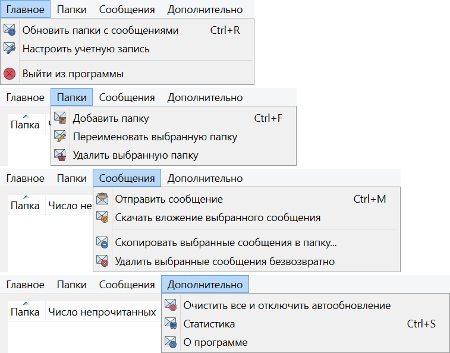

# Mail-Client

Почтовый клиент выполняет следующие задачи:
- пользовательская настройка параметров для авторизации (IMAP и SMTP);
- отображение электронных сообщений (IMAP);
- загрузка и сохранение вложений на диск, отправка сообщений с вложенными файлами (SMTP);
- добавление, переименование/перемещение и удаление папок электронной почты (IMAP);
- копирование и удаление сообщений (IMAP).

Подробное описание приведено в файле `Description.pdf`.

## Графический интерфейс

### Главное окно

### Меню главного окна

### Настройки

